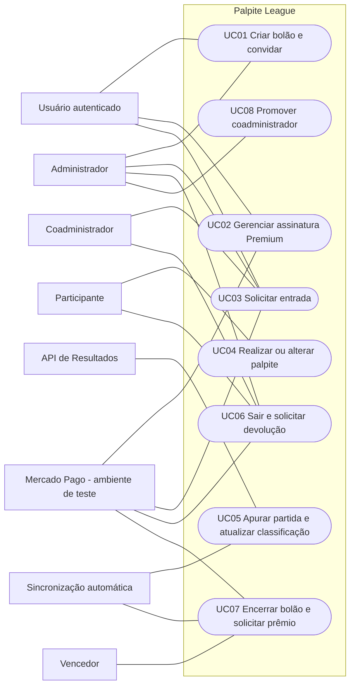
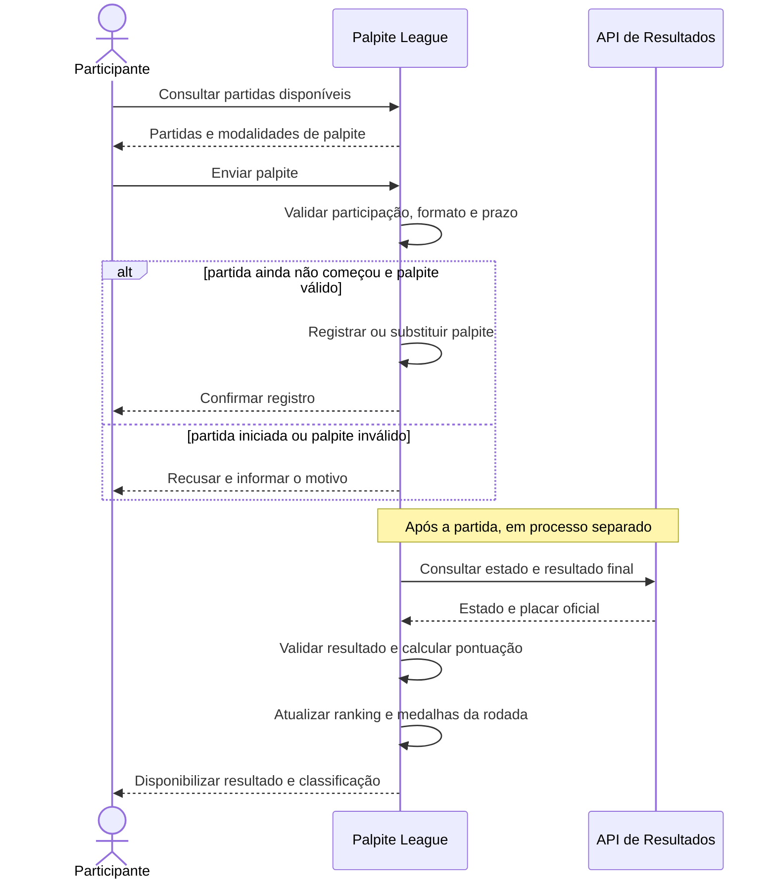

# Casos de Uso — Palpite League

Este documento consolida os principais casos de uso do Palpite League. Os fluxos refletem as regras de negócio e requisitos funcionais atuais, além das decisões confirmadas para a entrega acadêmica.

## Escopo de pagamentos

- A entrega final prevê a API de Assinaturas em ambiente de teste para Premium e Checkout Pro para taxa de entrada; devolução e premiação dependem de validação específica por operação.
- Durante o desenvolvimento e nos testes automatizados, um simulador poderá substituir o provedor externo. Para a demonstração acadêmica, ele também poderá simular a premiação caso o sandbox não ofereça repasse posterior; isso deve ficar visível e não atende à integração de premiação prevista.
- Não haverá cobranças, transferências ou movimentação de dinheiro real.
- A taxa de entrada usará Checkout Pro e a assinatura Premium usará a API de Assinaturas. A devolução e a premiação dependem da validação específica dos fluxos compatíveis no sandbox; não se deve apresentar uma operação simulada como confirmação do provedor.
- Operações aguardando confirmação permanecem pendentes. O sistema atualiza seu estado após confirmação verificável e não repete automaticamente uma cobrança ou devolução. Antes de uma nova tentativa, deve consultar o estado da operação anterior para prevenir duplicidade.

## Atores

| Ator | Responsabilidade |
| --- | --- |
| **Usuário** | Pessoa autenticada que pode criar bolões, contratar Premium ou solicitar entrada. |
| **Administrador** | Criador do bolão, responsável por suas configurações imutáveis, convites e análise de solicitações que exigem aprovação. |
| **Coadministrador** | Participante promovido pelo administrador, com as permissões administrativas atribuídas pelo sistema. |
| **Participante** | Usuário aprovado em um bolão, que registra palpites, acompanha resultados e pode solicitar saída. |
| **Vencedor** | Participante elegível identificado pelo sistema após o encerramento do bolão. |
| **API de Resultados** | Sistema externo que fornece partidas, estados e resultados oficiais. |
| **Mercado Pago (ambiente de teste)** | Provedor externo para operações de pagamento suportadas e validadas no ambiente de teste. |
| **Sincronização automática** | Processo iniciado pelo sistema para consultar resultados, recalcular pontuação e encerrar bolões. |

Administrador, coadministrador e participante são papéis por bolão; uma mesma pessoa pode exercer mais de um papel conforme as regras.

## Catálogo

| ID | Caso de uso | Ator principal/iniciador | Resultado |
| --- | --- | --- | --- |
| UC01 | Criar bolão e convidar participantes | Administrador | Bolão criado com regras e partidas selecionadas; convites disponibilizados. |
| UC02 | Contratar, consultar ou cancelar Premium | Usuário | Assinatura e recursos Premium refletem o estado confirmado pelo provedor. |
| UC03 | Solicitar entrada e confirmar participação | Usuário convidado | Participação confirmada após aceite, aprovação e pagamento confirmado, se houver taxa. |
| UC04 | Realizar ou alterar palpite | Participante | Palpite válido registrado antes do início da partida. |
| UC05 | Apurar partida e atualizar classificação | Sincronização automática | Resultado oficial processado, pontuações e ranking atualizados e medalhas concedidas. |
| UC06 | Sair do bolão e solicitar devolução | Participante | Saída registrada; eventual devolução só ocorre após aprovação e confirmação do provedor. |
| UC07 | Encerrar bolão e solicitar premiação | Sincronização automática / vencedor | Classificação final definida; solicitação elegível processada ou mantida pendente até confirmação. |
| UC08 | Promover participante a coadministrador | Administrador | Participante recebe o papel e as permissões administrativas correspondentes. |

## Diagrama de casos de uso

## UC01 — Criar bolão e convidar participantes

- **Ator principal:** Administrador
- **Ator secundário:** API de Resultados
- **Referências:** RF09, RF10, RF12, RF18; RB13–RB15, RB24

### Pré-condições

- O administrador está autenticado.
- O usuário está dentro do limite de criação permitido pelo plano.
- O sistema possui partidas e rodadas disponíveis para seleção.

### Fluxo principal

1. O administrador solicita a criação de um bolão.
2. O sistema verifica o limite de criação do plano.
3. O sistema apresenta as partidas e rodadas disponíveis obtidas da API de Resultados.
4. O sistema solicita nome, período, taxa de entrada, modelo de premiação, partidas e critério de desempate.
5. O administrador informa as configurações e seleciona partidas individualmente ou por rodada.
6. O sistema valida os dados e registra o bolão com as regras definidas.
7. O sistema cria a participação do criador com os papéis de administrador e participante.
8. O administrador solicita convites.
9. O sistema disponibiliza os convites por link ou mecanismo interno.

### Fluxos alternativos e exceções

- **A1 — Limite do plano atingido (passo 2):** o sistema impede a criação e informa o limite aplicável.
- **A2 — Partidas indisponíveis (passo 3):** o sistema informa a indisponibilidade da API, não inventa partidas e permite tentar novamente mais tarde.
- **A3 — Configuração inválida (passo 6):** o sistema informa os campos inválidos e não cria o bolão.

### Pós-condições

- O bolão existe com regras registradas e imutáveis.
- O criador possui participação no bolão.
- Os convites solicitados estão disponíveis.

## UC02 — Contratar, consultar ou cancelar Premium

- **Ator principal:** Usuário
- **Ator secundário:** Mercado Pago (ambiente de teste)
- **Referências:** RF05–RF08, RF31; RB01–RB12, RB53–RB56

### Pré-condições

- O usuário está autenticado.
- Para contratação ou cancelamento, o usuário não possui uma operação incompatível já pendente.

### Fluxo principal — Contratação

1. O usuário consulta os planos e solicita o Premium.
2. O sistema apresenta preço, recorrência e condições da assinatura.
3. O usuário confirma a contratação.
4. O sistema inicia a assinatura com o Mercado Pago em ambiente de teste e registra a operação como pendente.
5. O provedor processa a autorização e comunica o estado da assinatura.
6. O sistema verifica a confirmação recebida e atualiza o estado da assinatura.
7. Somente após confirmação válida, o sistema ativa os recursos Premium e registra a movimentação.

### Fluxo alternativo — Consulta

1. O usuário solicita os dados da assinatura.
2. O sistema apresenta plano, estado conhecido, vigência e cobranças registradas, identificando operações ainda pendentes.

### Fluxo alternativo — Cancelamento

1. O usuário solicita o cancelamento.
2. O sistema apresenta as condições e consequências conhecidas da assinatura.
3. O usuário confirma o cancelamento.
4. O sistema solicita o cancelamento ao provedor e mantém a operação pendente até confirmação.
5. Após confirmação, o sistema atualiza a assinatura e interrompe novas cobranças conforme o estado confirmado pelo provedor.
6. O sistema mantém os bolões já criados, aplicando as regras de plano gratuito apenas às novas criações.

### Fluxos alternativos e exceções

- **A1 — Pagamento recusado:** o sistema não ativa o Premium, registra o estado recusado e informa o usuário.
- **A2 — Confirmação ainda não recebida:** o sistema mantém a operação pendente e não altera o plano para Premium.
- **A3 — Provedor indisponível ou resposta inválida:** o sistema registra a falha, preserva o estado anterior e informa que a operação não foi confirmada.
- **A4 — Cancelamento recusado ou pendente:** a assinatura não é apresentada como cancelada; o estado comunicado pelo provedor permanece visível.
- **A5 — Nova tentativa:** antes de iniciar outra operação, o sistema consulta a anterior; não repete automaticamente cobrança ou cancelamento.

### Pós-condições

- O plano muda apenas após confirmação verificável do provedor.
- O histórico da operação e o estado final ou pendente ficam registrados.
- O cancelamento não exclui nem encerra bolões existentes.

## UC03 — Solicitar entrada e confirmar participação

- **Ator principal:** Usuário convidado
- **Atores secundários:** Administrador, coadministrador, Mercado Pago (ambiente de teste)
- **Referências:** RF11–RF16, RF30–RF31; RB17–RB23, RB59, RB61–RB62

### Pré-condições

- O usuário está autenticado e possui convite válido.
- O usuário ainda não está confirmado no bolão.

### Fluxo principal

1. O usuário acessa o convite.
2. O sistema valida o convite e apresenta regras, taxa de entrada e estado do bolão.
3. Se o bolão estiver em andamento, o sistema mostra as oportunidades de palpite já encerradas.
4. O usuário aceita as regras e, quando aplicável, confirma ciência da entrada tardia.
5. O sistema registra o aceite e a solicitação de entrada.
6. O administrador ou coadministrador aprova a solicitação.
7. Se houver taxa, o sistema inicia a cobrança pelo Mercado Pago em ambiente de teste e registra a operação como pendente.
8. O Mercado Pago informa o estado da cobrança.
9. O sistema verifica a confirmação, registra a movimentação e confirma a participação.

### Fluxos alternativos e exceções

- **A1 — Convite inválido, expirado ou indisponível (passo 2):** o sistema não registra a solicitação e informa o problema.
- **A2 — Regras não aceitas (passo 4):** o fluxo é encerrado sem solicitação.
- **A3 — Entrada tardia não confirmada (passo 4):** o fluxo é encerrado sem solicitação.
- **A4 — Solicitação rejeitada (passo 6):** o sistema informa a rejeição e não confirma a participação.
- **A5 — Sem taxa de entrada (passo 7):** após aprovação, o sistema confirma a participação sem iniciar cobrança.
- **A6 — Cobrança recusada:** o sistema não confirma a participação, registra o estado e informa o usuário.
- **A7 — Cobrança pendente ou provedor indisponível:** a participação permanece não confirmada; o sistema apresenta o estado pendente/indisponível e não cria outra cobrança automaticamente.
- **A8 — Nova tentativa:** antes de permitir uma nova cobrança, o sistema verifica o estado da operação anterior para evitar duplicidade.

### Pós-condições

- Em caso de sucesso, aceite, aprovação e confirmação do pagamento, quando aplicável, estão registrados.
- Em caso de rejeição, recusa ou pendência de pagamento, a participação não está confirmada.

## UC04 — Realizar ou alterar palpite

- **Ator principal:** Participante
- **Referências:** RF20–RF22; RB25–RB28

### Pré-condições

- O participante está aprovado e confirmado no bolão.
- A partida está selecionada para o bolão e ainda aceita palpites.
- A entrada do participante não ocorreu após o encerramento da janela de palpite da partida.

### Fluxo principal

1. O participante consulta as partidas disponíveis para palpite.
2. O sistema apresenta uma partida e as modalidades: resultado ou placar exato.
3. O participante informa um palpite de uma única modalidade.
4. O sistema valida a participação, a partida, o formato e o horário de início.
5. O sistema registra o palpite ou substitui o anterior.
6. O sistema confirma a operação ao participante.

### Fluxos alternativos e exceções

- **A1 — Partida já iniciada (passo 4):** o sistema recusa registro ou alteração e informa que o prazo terminou.
- **A2 — Palpite inválido (passo 4):** o sistema informa o erro e preserva o palpite anterior.
- **A3 — Participante sem direito a palpitar na partida (passo 4):** o sistema recusa a operação.

### Pós-condições

- Existe no máximo um palpite por participante e partida.
- Palpites só são criados ou alterados antes do início da partida.

## UC05 — Apurar partida e atualizar classificação

- **Iniciador:** Sincronização automática
- **Ator secundário:** API de Resultados
- **Referências:** RF23–RF29, RF39–RF40; RB29–RB43, RB60

### Pré-condições

- A partida selecionada para um ou mais bolões foi iniciada ou encerrada.
- A integração está configurada para consultar a API de Resultados.

### Fluxo principal

1. O sistema consulta o estado da partida e seu resultado na API de Resultados.
2. A API retorna dados da partida.
3. O sistema valida a resposta e atualiza o estado da partida. Apenas o placar final é registrado como resultado oficial.
4. Quando a partida estiver encerrada, o sistema compara o resultado oficial com cada palpite.
5. O sistema calcula os pontos segundo a modalidade do palpite.
6. O sistema atualiza a pontuação acumulada e o ranking de cada bolão afetado.
7. Ao término da rodada, o sistema calcula a pontuação da rodada e concede medalha a todos os participantes empatados na maior pontuação.
8. O sistema disponibiliza os resultados processados aos participantes.

### Fluxos alternativos e exceções

- **A1 — Resultado ainda indisponível (passo 2):** o sistema mantém os dados existentes e não pontua a partida.
- **A2 — API indisponível ou resposta inválida (passos 1–2):** o sistema registra a falha, preserva resultados já validados e permite nova sincronização; não permite inserir resultados oficiais manualmente.
- **A3 — Bolão sem acompanhamento ao vivo:** o resultado é disponibilizado após o encerramento da partida.
- **A4 — Rodada sem palpites válidos ou sem pontuação apurável:** o sistema não concede medalha sem participante elegível.

### Pós-condições

- Apenas resultado final obtido da fonte integrada é tratado como oficial.
- Pontuação e ranking refletem os resultados oficiais processados.
- Empate na pontuação máxima da rodada concede medalha a todos os empatados.

## UC06 — Sair do bolão e solicitar devolução

- **Ator principal:** Participante
- **Atores secundários:** Administrador, coadministrador, Mercado Pago (ambiente de teste)
- **Referências:** RF19, RF31–RF34; RB44–RB48, RB53–RB54, RB59

### Pré-condições

- O participante está confirmado no bolão.
- Para solicitar devolução, há uma taxa de entrada efetivamente paga e identificável.

### Fluxo principal — Saída

1. O participante solicita sua saída do bolão.
2. O sistema apresenta as consequências da saída e informa que ela não gera devolução automática.
3. O participante confirma a saída.
4. O sistema registra a saída e encerra a participação nas atividades futuras do bolão.

### Fluxo alternativo — Solicitação de devolução

Este fluxo ocorre após a saída ter sido registrada.

1. O participante solicita formalmente a devolução do valor elegível.
2. O sistema registra a solicitação e a disponibiliza para análise do administrador ou coadministrador.
3. O administrador ou coadministrador aprova ou rejeita a solicitação conforme as regras do bolão.
4. Se aprovada, o sistema solicita ao Mercado Pago a devolução da transação original em ambiente de teste.
5. O sistema mantém a devolução pendente até confirmação verificável do provedor.
6. Após confirmação, o sistema registra a movimentação concluída e informa o participante.

### Fluxos alternativos e exceções

- **A1 — Saída não confirmada (passo 3):** a participação permanece ativa.
- **A2 — Solicitação de devolução não aprovada (passo 3 do fluxo de devolução):** a solicitação é marcada como rejeitada, sem iniciar devolução.
- **A3 — Não há valor elegível ou transação localizável (passo 1 do fluxo de devolução):** o sistema informa o motivo e não encaminha a operação ao provedor.
- **A4 — Devolução recusada:** o sistema registra a recusa e informa o participante; não marca a devolução como concluída.
- **A5 — Devolução pendente ou API indisponível:** a solicitação permanece pendente, sem repetição automática.
- **A6 — Nova tentativa:** o sistema consulta a situação da devolução anterior antes de iniciar outra operação.

### Pós-condições

- A saída não depende da aprovação de devolução e não devolve valores automaticamente.
- A devolução só é concluída após aprovação administrativa e confirmação do Mercado Pago.
- Solicitação, decisão e movimentação ficam vinculadas para auditoria.

## UC07 — Encerrar bolão e solicitar premiação

- **Iniciador:** Sincronização automática
- **Ator principal:** Vencedor
- **Ator secundário:** Mercado Pago (ambiente de teste)
- **Referências:** RF31, RF35–RF37; RB42–RB53, RB63–RB65

### Pré-condições

- O período final do bolão foi atingido.
- Todos os resultados necessários à classificação final foram processados.
- O modelo de premiação foi definido na criação e os vencedores são elegíveis.

### Fluxo principal

1. O sistema encerra o bolão automaticamente.
2. O sistema calcula a classificação final e aplica o critério de desempate definido para o bolão.
3. O sistema registra e apresenta o vencedor ou vencedores elegíveis e o valor/modelo de premiação correspondente.
4. Um vencedor solicita o recebimento de sua parte da premiação.
5. O sistema valida a elegibilidade e os dados necessários à solicitação.
6. Sem exigir aprovação administrativa adicional, o sistema encaminha a operação ao Mercado Pago em ambiente de teste, somente se o repasse posterior estiver suportado e validado.
7. A operação fica pendente até o sistema verificar confirmação do provedor.
8. Após confirmação, o sistema registra a movimentação como concluída e informa o vencedor.

### Fluxos alternativos e exceções

- **A1 — Resultados necessários pendentes (passo 2):** o sistema não fecha a classificação nem determina o vencedor até processar os resultados.
- **A2 — Nenhum participante elegível:** o sistema encerra o bolão, registra que não há vencedor elegível e não solicita transferência.
- **A3 — Participante não elegível ou solicitação duplicada (passos 4–5):** o sistema recusa a solicitação.
- **A4 — API não oferece a operação de repasse em ambiente de teste:** o sistema informa que a premiação não foi processada pela API; não registra sucesso do provedor. A demonstração acadêmica poderá usar o simulador, identificado como simulação e sem alegar que a integração de premiação foi atendida.
- **A5 — Operação recusada:** o sistema registra a recusa e informa o vencedor, mantendo a premiação não concluída.
- **A6 — Operação pendente ou API indisponível:** o sistema mantém o estado pendente e não envia outra operação automaticamente.
- **A7 — Nova tentativa:** o sistema verifica primeiro o estado da operação anterior para evitar pagamento duplicado.

### Pós-condições

- A classificação final e o encerramento do bolão estão registrados.
- Não há aprovação administrativa adicional para o pagamento do vencedor.
- A premiação é marcada como concluída apenas após confirmação verificável do provedor.
- Operações simuladas nunca são exibidas como transferências concluídas pelo Mercado Pago.

## UC08 — Promover participante a coadministrador

- **Ator principal:** Administrador
- **Ator secundário:** Participante selecionado
- **Referências:** RF17; RB16, RB59

### Pré-condições

- O solicitante está autenticado e é administrador do bolão.
- O usuário selecionado possui participação no mesmo bolão.

### Fluxo principal

1. O administrador consulta os participantes do bolão.
2. O administrador seleciona um participante e solicita sua promoção.
3. O sistema valida o papel do solicitante e a participação do usuário selecionado.
4. O sistema atribui o papel de coadministrador e as permissões administrativas correspondentes.
5. O sistema confirma a alteração.

### Fluxos alternativos e exceções

- **A1 — Solicitante sem permissão (passo 3):** o sistema impede a alteração.
- **A2 — Usuário não participa do bolão (passo 3):** o sistema informa que a promoção não pode ser realizada.

### Pós-condições

- O participante selecionado possui papel de coadministrador naquele bolão.

## Sequência — Realizar palpite e apurar resultado

O palpite e a apuração são processos distintos. O participante registra seu palpite antes da partida; a sincronização e pontuação acontecem depois, quando a API disponibiliza o resultado final.

## Referências a artefatos gráficos existentes

O arquivo [diagrama_casos_de_uso_realizar_palpite.png](./diagrama_casos_de_uso_realizar_palpite.png) é um diagrama legado: ele associa a consulta do resultado ao fluxo de realização do palpite e não representa o catálogo completo. Os diagramas Mermaid deste documento são a fonte atual e devem ser usados para consulta; não usar o PNG legado como especificação.

## Pendências técnicas que não bloqueiam a especificação dos fluxos

- Executar smoke tests no ambiente de teste para Checkout Pro e assinatura; confirmar o fluxo de reembolso compatível com Checkout Pro e investigar repasse posterior de premiação. A validação documental está registrada em [Validação documental do Mercado Pago](../arquitetura/validacao-mercado-pago.md).
- Se o repasse não estiver disponível, a demonstração poderá simular a premiação, claramente identificada; o caso deve continuar sem sucesso externo e a integração correspondente deve permanecer pendente.
