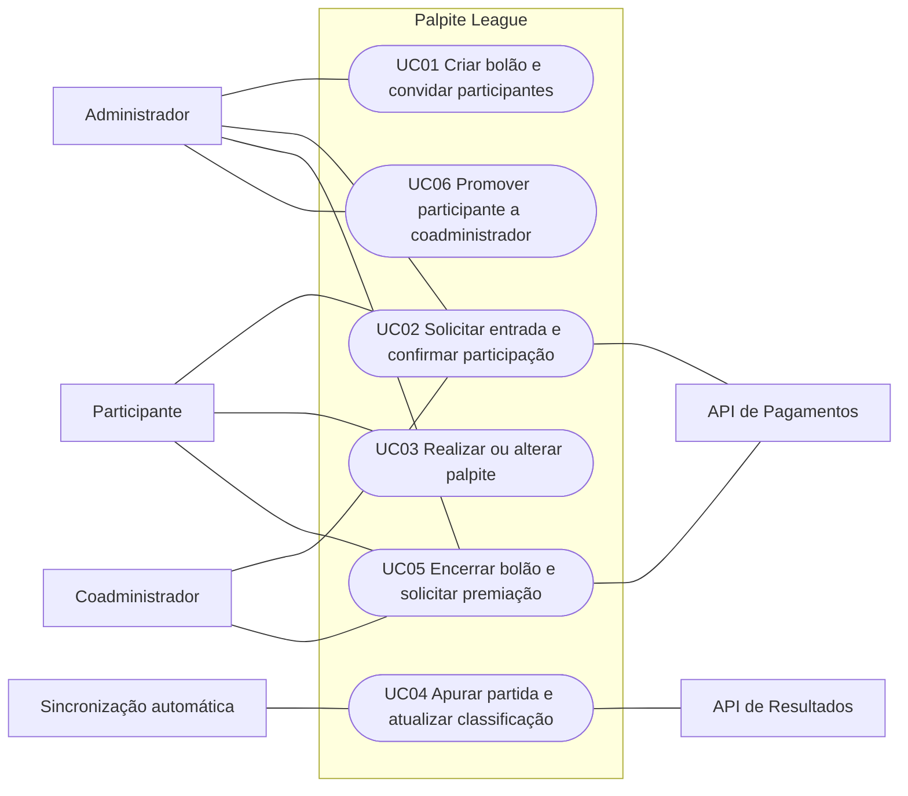

# Casos de Uso — Palpite League

Este documento descreve os principais fluxos ponta a ponta do Palpite League. Os casos foram derivados dos requisitos funcionais e das regras de negócio existentes; as referências aparecem ao final de cada caso.

## Escopo de pagamentos

Para a entrega final, os casos consideram uma API de pagamentos em ambiente de teste para assinatura Premium, taxa de entrada, devolução e premiação. Durante o desenvolvimento, um simulador poderá substituir essa integração. Não se considera movimentação de dinheiro real.

O fornecedor da API, a confirmação assíncrona de pagamentos e as condições para reprocessar operações pendentes ainda precisam ser definidos nas decisões técnicas e nos ADRs. O escopo acima amplia o ADR-0003 atual, que trata somente da assinatura Premium; esse ADR deverá ser revisado na etapa de arquitetura.

## Atores

| Ator | Responsabilidade |
| --- | --- |
| **Usuário** | Pessoa autenticada que cria bolões ou participa deles. |
| **Administrador** | Criador do bolão; define suas regras, convida pessoas e analisa solicitações. |
| **Coadministrador** | Participante promovido pelo administrador, com as permissões administrativas definidas pelo sistema. |
| **Participante** | Usuário aprovado no bolão, responsável por registrar palpites e acompanhar os resultados. |
| **API de Resultados** | Sistema externo que fornece partidas e resultados oficiais. |
| **API de Pagamentos** | Sistema externo que processa operações financeiras em ambiente de teste. |

Administrador, coadministrador e participante representam papéis no contexto de um bolão; uma mesma pessoa pode exercer mais de um papel conforme as regras do domínio.

## Catálogo

| ID | Caso de uso | Ator principal | Resultado |
| --- | --- | --- | --- |
| UC01 | Criar bolão e convidar participantes | Administrador | Bolão criado com regras definidas e convites disponibilizados. |
| UC02 | Solicitar entrada e confirmar participação | Participante | Participação confirmada após aceite, aprovação e, quando aplicável, pagamento aprovado. |
| UC03 | Realizar ou alterar palpite | Participante | Palpite válido registrado antes do início da partida. |
| UC04 | Apurar partida e atualizar classificação | Sincronização automática | Resultado oficial registrado; pontuações, ranking e medalha da rodada atualizados. |
| UC05 | Encerrar bolão e solicitar premiação | Participante vencedor | Vencedor(es) determinado(s) e solicitação de premiação processada pela API de Pagamentos em ambiente de teste. |
| UC06 | Promover participante a coadministrador | Administrador | Participante recebe o papel e as permissões administrativas correspondentes. |

## Diagrama de contexto

## UC01 — Criar bolão e convidar participantes

- **Ator principal:** Administrador
- **Ator secundário:** API de Resultados
- **Referências:** RF09, RF10, RF12, RF18; RB13–RB15, RB24

### Pré-condições

- O usuário está autenticado.
- O usuário não excedeu o limite de bolões permitido pelo plano.
- As partidas e rodadas necessárias estão disponíveis para seleção.

### Fluxo principal

1. O administrador solicita a criação de um bolão.
2. O sistema verifica o limite de criação do plano.
3. O sistema apresenta as partidas e rodadas disponíveis, obtidas da API de Resultados.
4. O sistema solicita nome, período, taxa de entrada, modelo de premiação, partidas e critério de desempate.
5. O administrador informa as configurações e seleciona partidas individualmente ou por rodada.
6. O sistema valida os dados e registra o bolão com as regras definidas.
7. O sistema cria a participação do criador com os papéis de administrador e participante.
8. O administrador solicita convites para usuários.
9. O sistema disponibiliza os convites por link ou mecanismo interno.

### Fluxos alternativos e exceções

- **A1 — Limite do plano atingido (passo 2):** o sistema impede a criação e informa que o usuário precisa se adequar ao limite do plano.
- **A2 — Configuração inválida (passo 6):** o sistema informa os dados inválidos e não cria o bolão.

### Pós-condições

- O bolão existe com as regras registradas e imutáveis.
- O criador possui participação no bolão.
- Os convites solicitados estão disponíveis.

## UC02 — Solicitar entrada e confirmar participação

- **Ator principal:** Participante
- **Atores secundários:** Administrador, coadministrador, API de Pagamentos
- **Referências:** RF11–RF16, RF30; RB17–RB23, RB59, RB61–RB62

### Pré-condições

- O participante está autenticado e possui um convite válido.
- O participante ainda não está confirmado no bolão.

### Fluxo principal

1. O participante acessa o convite.
2. O sistema valida o convite e apresenta as regras, a taxa de entrada e o estado do bolão.
3. Se o bolão estiver em andamento, o sistema informa quais oportunidades de palpite já foram encerradas.
4. O participante aceita as regras e, se aplicável, confirma ciência da entrada tardia.
5. O sistema registra o aceite e a solicitação de entrada.
6. O administrador ou coadministrador aprova a solicitação.
7. Se houver taxa de entrada, o sistema encaminha o participante à API de Pagamentos em ambiente de teste.
8. A API de Pagamentos confirma a operação.
9. O sistema registra a movimentação e confirma a participação.

### Fluxos alternativos e exceções

- **A1 — Convite inválido ou indisponível (passo 2):** o sistema não registra a solicitação e informa o problema.
- **A2 — Regras não aceitas (passo 4):** o participante não prossegue e não é incluído no bolão.
- **A3 — Entrada tardia não confirmada (passo 4):** o sistema não registra a solicitação.
- **A4 — Solicitação rejeitada (passo 6):** o sistema informa a rejeição e a participação não é confirmada.
- **A5 — Sem taxa de entrada (passo 7):** o sistema dispensa o pagamento e confirma a participação após a aprovação.
- **A6 — Pagamento recusado ou ainda não confirmado (passos 8–9):** o sistema não confirma a participação financeira nem a participação no bolão; informa o estado da operação.

### Pós-condições

- Em caso de sucesso, o aceite das regras fica registrado e a participação é confirmada após aprovação e, quando aplicável, confirmação do pagamento.
- Em caso de falha ou rejeição, a participação permanece não confirmada.

## UC03 — Realizar ou alterar palpite

- **Ator principal:** Participante
- **Referências:** RF20–RF22; RB25–RB28

### Pré-condições

- O participante está aprovado e confirmado no bolão.
- A partida está selecionada para o bolão.
- O participante pode palpitar para essa partida, considerando sua data de entrada.

### Fluxo principal

1. O participante consulta as partidas disponíveis para palpite.
2. O sistema apresenta a partida e as modalidades permitidas: resultado ou placar exato.
3. O participante informa um palpite de uma única modalidade.
4. O sistema valida a participação, a partida, o formato do palpite e se a partida ainda não começou.
5. O sistema registra o palpite ou substitui o palpite anterior.
6. O sistema confirma o registro ao participante.

### Fluxos alternativos e exceções

- **A1 — Partida já iniciada (passo 4):** o sistema recusa o registro ou alteração e informa que o prazo foi encerrado.
- **A2 — Palpite inválido (passo 4):** o sistema informa o erro e não altera o palpite existente.
- **A3 — Participante sem direito a palpitar na partida (passo 4):** o sistema recusa a operação.

### Pós-condições

- Há no máximo um palpite do participante para aquela partida.
- O palpite só é criado ou alterado antes do início da partida.

## UC04 — Apurar partida e atualizar classificação

- **Iniciador:** Sincronização automática do sistema
- **Ator secundário:** API de Resultados
- **Referências:** RF23–RF29, RF39–RF40; RB29–RB43, RB60

### Pré-condições

- A partida selecionada para um ou mais bolões foi iniciada ou encerrada.
- A integração está autorizada a consultar dados da API de Resultados.

### Fluxo principal

1. O sistema consulta a API de Resultados conforme a atualização prevista para a partida.
2. A API retorna o estado da partida e, quando disponível, o resultado oficial.
3. O sistema valida e registra os dados recebidos; somente o resultado final é registrado como resultado oficial.
4. Quando a partida estiver encerrada, o sistema compara o resultado oficial com cada palpite registrado.
5. O sistema atribui a pontuação definida para cada palpite.
6. O sistema atualiza a pontuação acumulada e a classificação dos participantes em cada bolão aplicável.
7. Ao término da rodada, o sistema identifica o participante ou participantes com a maior pontuação na rodada e registra a medalha visual correspondente.
8. O sistema disponibiliza os resultados atualizados aos participantes.

### Fluxos alternativos e exceções

- **A1 — Resultado ainda indisponível (passo 2):** o sistema preserva os dados existentes e não calcula pontuação para a partida.
- **A2 — API indisponível ou resposta inválida (passos 1–2):** o sistema preserva os dados, registra a falha e permite nova sincronização; nenhum resultado é inserido manualmente.
- **A3 — Bolão sem acompanhamento ao vivo:** o sistema disponibiliza o resultado após o encerramento da partida.

### Pós-condições

- Apenas o resultado final obtido da API de Resultados é registrado como oficial.
- Pontuações e classificação refletem os resultados oficiais processados.
- As medalhas não alteram pontuação nem premiação.

## UC05 — Encerrar bolão e solicitar premiação

- **Ator principal:** Participante vencedor
- **Ator secundário:** API de Pagamentos
- **Referências:** RF19, RF31, RF35–RF37; RB42–RB53, RB63–RB65

### Pré-condições

- O bolão atingiu o período final definido na criação.
- Os resultados necessários para a classificação final foram processados.
- O modelo de premiação está registrado no bolão.

### Fluxo principal

1. O sistema encerra o bolão ao atingir seu período final.
2. O sistema calcula a classificação final e aplica o critério de desempate definido na criação.
3. O sistema identifica o vencedor ou vencedores elegíveis e apresenta o resultado.
4. Um vencedor solicita o recebimento da premiação disponível.
5. O sistema valida a elegibilidade, os dados necessários à operação e a solicitação.
6. O sistema encaminha a operação à API de Pagamentos em ambiente de teste, de acordo com o modelo de premiação.
7. A API de Pagamentos confirma a operação.
8. O sistema registra a movimentação financeira e informa o resultado ao vencedor.

### Fluxos alternativos e exceções

- **A1 — Resultado pendente (passo 2):** o sistema não finaliza a classificação enquanto houver resultados necessários ainda não processados.
- **A2 — Participante não elegível (passos 3–5):** o sistema impede a solicitação.
- **A3 — Operação recusada ou ainda não confirmada (passos 6–7):** o sistema mantém a solicitação sem marcar a premiação como concluída e informa seu estado.

### Pós-condições

- O bolão está encerrado e sua classificação final está disponível.
- Uma premiação só é marcada como concluída após confirmação da operação pela API de Pagamentos.
- A movimentação correspondente fica registrada para rastreabilidade.

## UC06 — Promover participante a coadministrador

- **Ator principal:** Administrador
- **Ator secundário:** Participante selecionado
- **Referências:** RF17; RB16, RB59

### Pré-condições

- O administrador está autenticado e possui esse papel no bolão.
- O usuário selecionado é participante do mesmo bolão.

### Fluxo principal

1. O administrador consulta os participantes do bolão.
2. O administrador seleciona um participante e solicita sua promoção.
3. O sistema valida o papel do solicitante e a participação do usuário selecionado.
4. O sistema atribui o papel de coadministrador e as permissões administrativas correspondentes.
5. O sistema confirma a alteração.

### Fluxos alternativos e exceções

- **A1 — Solicitante sem permissão (passo 3):** o sistema impede a alteração.
- **A2 — Usuário não participa do bolão (passo 3):** o sistema informa que a promoção não pode ser realizada.

### Pós-condições

- O participante selecionado possui papel de coadministrador naquele bolão.

## Pontos a detalhar na próxima revisão

- Definir fornecedor e capacidades da API de Pagamentos, inclusive se ela suporta as operações pretendidas em ambiente de teste.
- Definir como o sistema recebe e verifica confirmações assíncronas de pagamento e como trata retentativas sem duplicar movimentações.
- Definir regras de elegibilidade, prazo, dados necessários e eventuais aprovações para devoluções e pagamentos de prêmio.
- Definir o resultado quando houver empate na maior pontuação de uma rodada para concessão da medalha.
- Detalhar os casos de contratação/cancelamento da assinatura Premium, saída do bolão e solicitação/aprovação de devolução, não incluídos nestes fluxos principais.
- Definir se a premiação exige aprovação administrativa antes de ser enviada à API de Pagamentos.
- Atualizar os diagramas PNG existentes para refletir este catálogo e separar a realização do palpite da apuração posterior.
